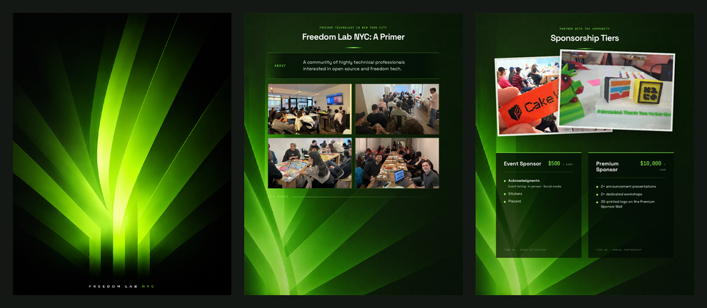

# Freedom Lab NYC Sponsor Package

Editable source for Freedom Lab NYC's three-page sponsorship package.



- **Live preview:** https://freedomlab.nyc/sponsors-html/
- **Published PDF:** https://freedomlab.nyc/sponsor/
- **Fork this repository:** https://github.com/FreedomLabNYC/freedomlab-sponsor-package/fork

## Pages

1. Cover artwork
2. Freedom Lab NYC primer, community photos, and key statistics
3. Event Sponsor and Premium Sponsor tiers

Pages 2 and 3 are editable HTML/CSS. Page 1 uses the approved supplied raster artwork at `src/assets/cover-art.png`; replace that asset to change the artwork while preserving the page frame.

## Quick start

```bash
npm install
npm run preview
```

Open http://localhost:8000.

## Export the PDF

```bash
npm run export:pdf
```

This starts a temporary local server, opens the real HTML in Chromium, verifies three pages and all images, and writes:

```text
dist/freedom-lab-sponsorship-package.pdf
```

The output must contain exactly three US Letter pages.

## Editing

- Main markup: `src/index.html`
- Visual system and layouts: `src/styles.css`
- Images and fonts: `src/assets/`
- Exporter: `scripts/export-pdf.mjs`
- Agent editing guide: `EDITING_GUIDE.md`

All assets use relative paths. No paid or nondeterministic image generation is required.

## Sharing changes

1. Fork the repository.
2. Create a branch.
3. Edit the HTML/CSS/assets.
4. Run `npm run export:pdf`.
5. Commit both source changes and the regenerated PDF.
6. Open a pull request with screenshots or the new PDF attached.
