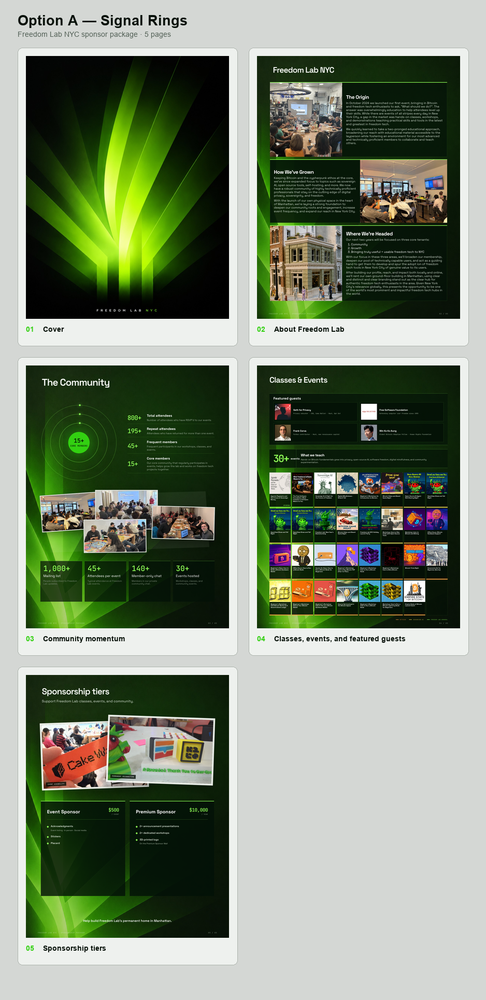
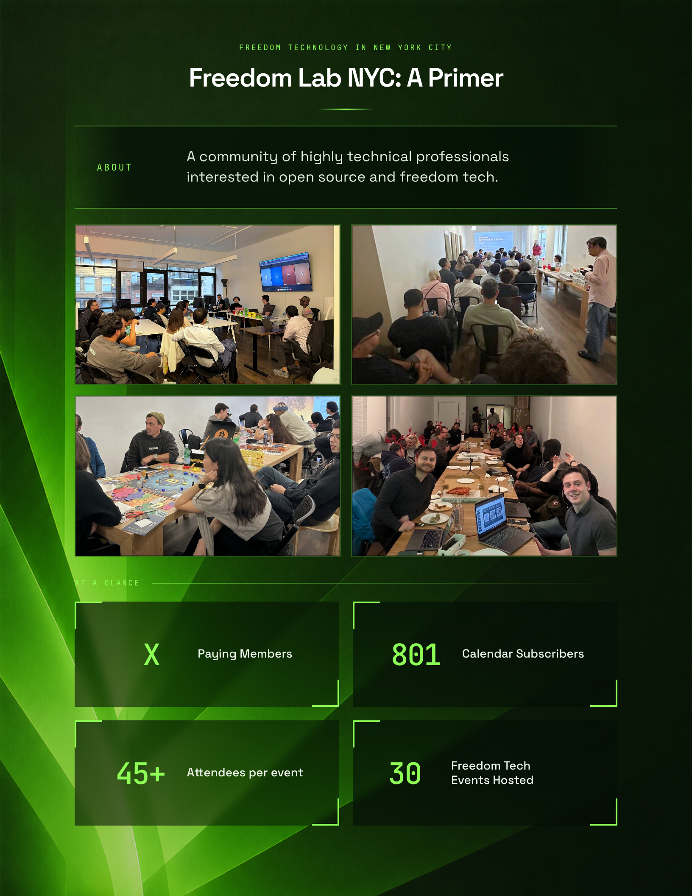
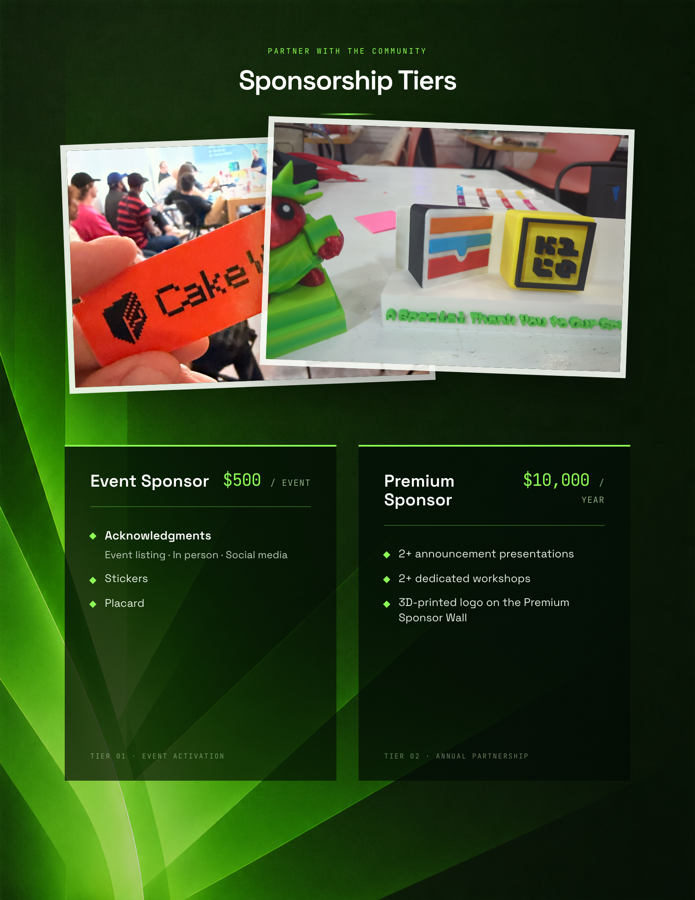

# Freedom Lab NYC Sponsor Package

Editable source for Freedom Lab NYC's selected five-page Signal Rings sponsorship package, plus the earlier three-page package and three archived concept alternatives.

## Selected five-page preview

[](docs/concepts/signal-rings-contact-sheet.png)

Open the individual full-resolution renders under `docs/concepts/signal-rings/` when reviewing copy, crops, or spacing.

## Earlier three-page preview

Each page is shown separately so the copy and numerical modules remain readable. Click any page to open its original resolution.

### Page 1 — Cover

[](docs/preview/page-01-cover.png)

### Page 2 — Primer

[](docs/preview/page-02-primer.png)

### Page 3 — Sponsorship tiers

[](docs/preview/page-03-sponsorship-tiers.png)

- **Selected live PDF:** https://freedomlab.nyc/pdf1/
- **Earlier three-page preview:** https://freedomlab.nyc/sponsors-html/
- **Earlier three-page PDF:** https://freedomlab.nyc/sponsor/
- **Fork this repository:** https://github.com/FreedomLabNYC/freedomlab-sponsor-package/fork

## Selected package pages

1. Cover artwork
2. Freedom Lab story: origin, growth, and direction
3. The Community: participation rings, photo collage, and current totals
4. Classes & Events: featured guests and the complete event archive
5. Event Sponsor and Premium Sponsor tiers

Pages 2–5 are editable through `src/concepts/`. Page 1 uses the approved supplied raster artwork at `src/assets/cover-art.png`. The earlier three-page package remains under `src/index.html` and `src/styles.css` for historical compatibility.

## Quick start

```bash
npm install
brew install qpdf
npm run preview
```

Open http://localhost:8000.

## Sponsor package concept study

Four isolated, complete deck directions live at:

```text
http://localhost:8000/concepts/
```

- **Signal Rings** — cinematic, human, and data-forward
- **Field Notes** — light editorial documentary
- **Street Level** — architectural and Manhattan-focused
- **Open Protocol** — technical and cypherpunk

Each option includes the current cover, a new Freedom Lab story page, audited community RSVP rings, four verified featured guests, all 31 archived/upcoming events, and the existing sponsorship tiers. Signal Rings uses five pages by integrating featured guests into Classes & Events and fitting all 31 square event images and full event titles into one half-page grid; the other studies remain seven pages. The canonical three-page package is unchanged while the concepts are under review.

```bash
npm run prepare:concepts
npm run export:concepts
npm run smoke:concepts
```

Concept PDFs are written to `dist/concepts/`; page renders and contact sheets are written to `docs/concepts/`. Research and source provenance are in `docs/concepts/RESEARCH.md`.

### Update the story page in seconds

The selected deck's three-part story has one source of truth:

```text
src/concepts/data/story.md
```

Edit that Markdown file directly, or replace it atomically from a file or the clipboard:

```bash
npm run story:update -- /path/to/story.md
pbpaste | npm run story:update -- -
npm run story:check
npm run story:export
npm run story:publish
```

Use exactly three level-one headings (`# Heading`). Plain paragraphs and numbered lists are preserved in order. The updater validates the full document before replacing the last-known-good copy. The focused exporter replaces only page 2 in the existing five-page PDF, renders only that page for review, and checks the resulting PDF. `story:publish` then runs the shared deck publisher. The publisher stages only the PDF and viewer wrapper, gives the PDF URL a SHA-derived cache version, pushes both, and polls every two seconds until the live PDF hash and wrapper version match. Story copy never needs to be duplicated in JavaScript or test code.

For accepted changes to any other page, export the selected deck and publish it with:

```bash
node scripts/export-concepts.mjs --option=a --screenshot-page=<page> --skip-contact-sheet
npm run deck:publish -- --message='Describe the accepted change'
```

## Export the PDF

```bash
npm run export:pdf
```

This starts a temporary local server, opens the real HTML in Chromium, verifies three pages and all images, and writes:

```text
dist/freedom-lab-sponsorship-package.pdf
```

The output must contain exactly three US Letter pages.

## Editing

- Main markup: `src/index.html`
- Visual system and layouts: `src/styles.css`
- Images and fonts: `src/assets/`
- Exporter: `scripts/export-pdf.mjs`
- Agent editing guide: `EDITING_GUIDE.md`

All assets use relative paths. No paid or nondeterministic image generation is required.

## Sharing changes

1. Fork the repository.
2. Create a branch.
3. Edit the HTML/CSS/assets.
4. Run `npm run export:pdf`.
5. Commit both source changes and the regenerated PDF.
6. Open a pull request with screenshots or the new PDF attached.
